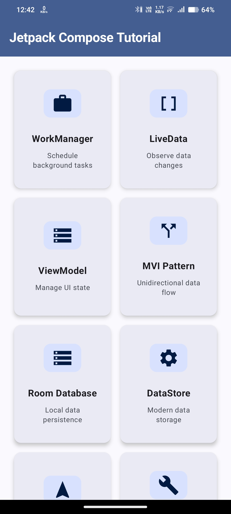
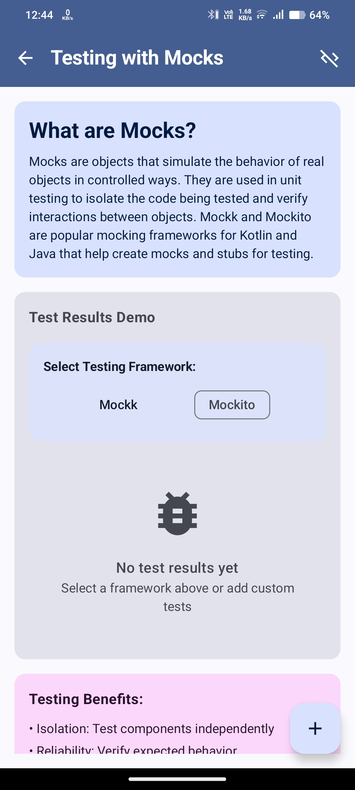
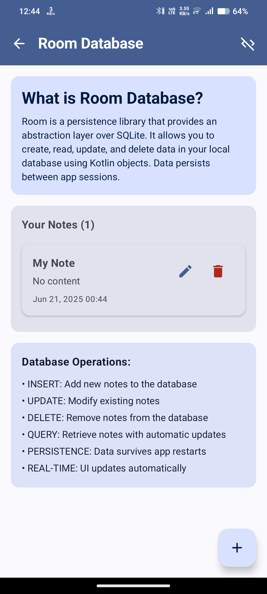

# Jetpack Compose Tutorial

This repository contains a collection of tutorials for various Jetpack Compose and Android Architecture Components, all within a single Android application. Each tutorial is designed to be a practical, hands-on example.

## ✨ Features

- **Animated Splash Screen**: A custom-built, fully animated splash screen to welcome users.
- **Redesigned Dashboard**: A modern, card-based UI for navigating between different tutorials.
- **Immersive UI**: The application uses edge-to-edge display for a more immersive experience.

## 📸 Screenshots & Demos

Here are some glimpses of the app in action:

| Splash Screen | WorkManager | LiveData/StateFlow |
| :---: | :---: | :---: |
|  |  |  |

| App Screenshot 1 | App Screenshot 2 | App Screenshot 3 |
| :---: | :---: | :---: |
|  |  |  |

## 📚 Tutorials Included

This application includes the following tutorials:

### 1. WorkManager Tutorial
- Demonstrates how to use `WorkManager` for deferrable background tasks.
- Shows how to observe the status of the work and display progress using a `LinearProgressIndicator`.

### 2. LiveData & StateFlow Tutorial
- A practical example of using `StateFlow` (refactored from `LiveData`) for observing data streams in a Compose-centric way.
- Includes a real-time number generator and a "Trip Commuter" example.
- Features a code-toggle button to show/hide the implementation details right on the screen.

### 3. ViewModel Tutorial
- A "Task Manager" example demonstrating how to use a `ViewModel` to manage UI-related data.
- Covers state management, filtering, and sorting of data within the `ViewModel`.
- Includes a detailed explanation of the `ViewModel`'s role and benefits.

### 4. MVI (Model-View-Intent) Tutorial
- An implementation of the MVI architecture pattern with a search feature example.
- Clearly separates `State`, `Intent`, and `Effect` for a unidirectional data flow.

### 5. Room Database Tutorial
- A complete example of using Room for local data persistence.
- Demonstrates full CRUD (Create, Read, Update, Delete) operations on a `Note` entity.
- Includes the setup of `Entity`, `DAO`, `Database`, `Repository`, and `ViewModel`.

## 🚀 How to Get Started

1.  **Clone the repository:**
    ```bash
    git clone https://github.com/your-username/JetpackComposeTutorial.git
    ```
2.  **Open in Android Studio:**
    -   Open Android Studio (latest stable version recommended).
    -   Click on `File` > `Open` and select the cloned repository.
3.  **Build and Run:**
    -   Let Android Studio sync the Gradle files.
    -   Run the application on an Android emulator or a physical device.

---

*This project is built for educational purposes to demonstrate modern Android development with Jetpack Compose.*
